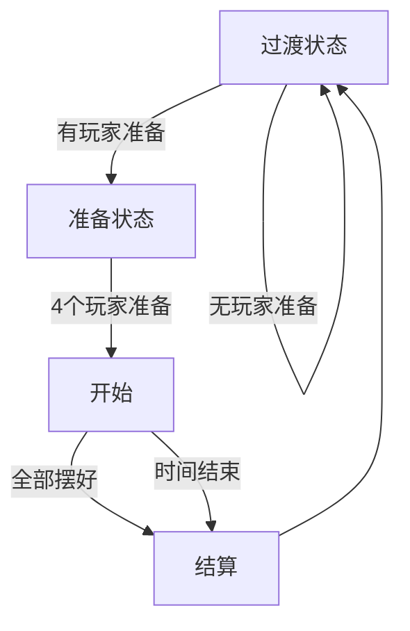

# 流程图

```mermaid
graph TD;
     状态0[过渡状态]--有玩家准备-->状态100[准备状态];
     状态0--无玩家准备-->状态0;
     状态100--4个玩家准备-->状态101[开始];
     状态101--全部摆好-->状态102[结算];
     状态101--时间结束-->状态102;
     状态102-->状态0;
```
